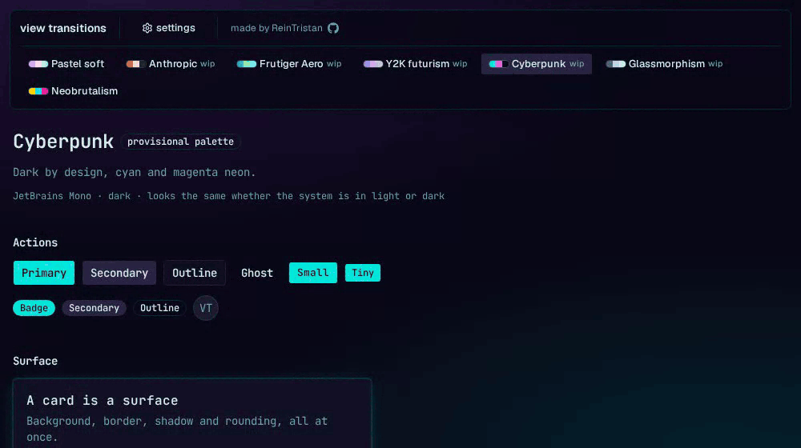

# view-transition-lab

**[Live demo → vtlab.reintristan.dev](https://vtlab.reintristan.dev)**

A small lab for understanding and practicing the **View Transitions API**.

The main idea is to get **the same interaction** using multiple animation engines to compare flavors and options testing it with multiple themes through a theme switcher.



Recorded at 1×, the real 600 ms. The circle always opens from the point you clicked.

> [!Warning] Work in progress. This is a proof of concept. I'm not a designer neither and artist so if the themes lack of some characteristics or style let me know.

## Current state

**Themes** — seven different themes, with not light/dark variants of a single design. Each one
brings its own style.

| Theme | Font | Style | Status | 
|---|---|---| --- |
| Pastel soft | Quicksand | Pastel tones of lavender, pink and mint over warm white. Wide radius, diffuse low-opacity shadows, soft gradient background. | ✔️ partially-designed |
| Neobrutalism | Archivo | Acid yellow, electric cyan and magenta over off-white and pure black. Zero radius, 3px borders, solid offset shadows — buttons shift into their shadow when pressed. |✔️ partially-designed |
| Anthropic | Source Serif 4 | Warm orange and editorial serif, inspired by the Anthropic and Claude pages. Plenty of air, marked typographic hierarchy, low saturation except for the accent. |🎨 palette |
| Frutiger Aero | Titillium Web | The colorful future of the 2000s: aqua and green, wet gloss, bubbles, nature. High saturation and vertical sky-to-grass gradients. |🎨 palette |
| Y2K futurism | Orbitron | The other 2000s: chrome and silver, hard metallic gradients with abrupt stops, blob shapes and techno type. The widest radius of the seven. |🎨 palette |
| Cyberpunk | JetBrains Mono | Cyan and magenta neon glowing over very dark violet. Monospaced type and a tight radius. |🎨 palette |
| Glassmorphism | Manrope | The transparent one: real `backdrop-filter`, hairline borders, and a neutral gradient background so the glass has something to blur. No gloss. |🎨 palette |

The current ones were implemented first to test the contrast of opposites designs. The rest are more sibling themes thats why are implemented later.

**Modes** — how the wipe is produced. This is the axis the engines are compared on, and the
same engine can implement more than one:

| mode | mechanism |
|---|---|
| `native` | Declarative CSS animation on `::view-transition-new(root)`. No library involved. |
| `bridge` | The browser takes the snapshots; a JS library drives the progress by writing `--vt-progress` on `:root`. |
| `overlay` | No View Transitions API at all: a real element animated by the library, with the theme swap happening midway through. **Not implemented yet** — it'll arrive soon. |

**Engines** — who runs the animation:

***Current***

| engine | modes | chunk | notes |
|---|---|---|---|
| Vanilla | `native` | 0.23 kB | No library at all. The animation is hand-written CSS on the pseudo-element. |
| Tailwind | `native` | 0.23 kB | The same wipe written through Tailwind utilities. 1 of 5 sub-engines ready: **core**, a CSS transition with `@starting-style`. |
| Anime.js | `bridge` | 30.45 kB | One `requestAnimationFrame` loop shared by every animation on the page. |
| Motion | `bridge` | 61.45 kB | The reference implementation of the bridge. |
| GSAP | `bridge` | 69.95 kB | Its own ticker. Flip lands with the overlay mode. |

Engines are loaded lazily, so the bundle weight the lab measures is real — and that column is
already a finding rather than trivia. The three bridge engines do the identical job: animate one
scalar from 0 to 1 on the same curve, write it to `--vt-progress`, let the same `clip-path`
consume it. Driven through the real UI they are indistinguishable, frame for frame. Anime.js
costs half of Motion and under half of GSAP for that same result.

The two native engines weigh the same for the opposite reason: their chunk is only the call to
`startViewTransition`. The wipe itself is CSS and lands in the main stylesheet, so that column
cannot see what a Tailwind sub-engine costs — only the stylesheet can.

The curve is held constant on purpose, each library spelling it its own way — Motion's
`cubic-bezier(0.22, 1, 0.36, 1)`, GSAP's `power4.out`, Anime's `outQuint`. If two engines looked
different, something would be broken rather than interesting.

***Upcoming***

| engine | modes | notes |
|---|---|---|
| Tailwind sub-engines | `native` | `tw-animate-css`, `tailwind-animations`, `tailwindcss-animated` and `tailwindcss-motion`: the same wipe asked of each library through its own utilities. Already listed in the picker as pending. |

GSAP and Anime.js also declare `overlay`. The `mode` selector now exists — it lives in the
settings popover, next to the engine — but no engine ships an overlay module yet, so the option is
listed there as pending rather than hidden.


## Methodology

- **The DOM is the source of truth for the theme, not React.** Changing the theme mutates
  `document.documentElement` synchronously; React only mirrors the value to render the picker.
  If the theme lived in `useState`, batching would delay the mutation and `startViewTransition`
  would capture a "new" snapshot identical to the old one.
- **The project never reads `prefers-color-scheme`.** Cyberpunk is dark because it is designed
  that way, and it looks identical whether the OS is in light or dark mode. The only preference
  media query consulted anywhere is `prefers-reduced-motion`.
- **The `bridge` mode.** `::view-transition-*` pseudo-elements are not DOM nodes, so JS
  libraries have nothing to grab. The bridge is a custom property: the library animates a
  scalar, writes it to `--vt-progress`, and the pseudo-element's `clip-path` consumes it.
- **The `overlay` mode is the control.** It is the same interaction without the View Transitions
  API, instead a real element is animated. Having it side by side makes a good point for comparing the cost
  and the benefit of the API visible rather than assume.

## Testing

Vitest in **browser mode** — Playwright provider, Chromium headless. jsdom would be useless here:
`startViewTransition` does not exist in it, `::view-transition-*` pseudo-elements are not DOM
nodes, and half of what the suite asserts is computed style out of a real cascade with Tailwind
compiled for real.

190 tests over the store, the theme registry, the DOM contract, the surface contract of all seven
themes, the orchestrator and the controls. `document.getAnimations()` filtered by
`effect.pseudoElement` is the only window into the pseudo-elements, and it is how the `bridge`
keepalive is actually tested rather than assumed.

The piece worth knowing about is the **engine conformance suite**. It enumerates
`engineList.filter((engine) => engine.ready)`, so an engine enrols itself the day its loader lands
— no test to write. Not a hope, either: GSAP and Anime.js were both added that way and each passed
the whole bridge block on the first run. Tailwind passed four of the five on its first run too; the
fifth only fell because the native branch still named vanilla's keyframes, and now asserts what
the mode promises instead — some CSS on the pseudo-element, and the bridge untouched. Every engine
has to prove the same five things: it
skips the API under reduced motion, it still swaps the theme in a browser with no View Transitions
API, it leaves no `--vt-*` behind, it lasts roughly as long as it was told to, and it animates the
root pseudo-element in its declared mode.

Tests live in `test/` at the root with their own `tsconfig.test.json`, referenced from the
solution file — so `pnpm build` typechecks them too and a broken test breaks the build.

## Stack

React 19 · TypeScript 7 · Vite · Tailwind v4 · shadcn/ui (on Base UI) · React Router · Motion ·
GSAP · Anime.js · Zustand · Biome · Vitest

## Development

```sh
pnpm install
pnpm dev            # http://localhost:5173
pnpm build
pnpm lint
pnpm test           # vitest in browser mode, watch
pnpm test:run       # one pass
pnpm test:coverage  # v8 report over the core
```

Requires a browser with [View Transitions API support](https://caniuse.com/view-transitions).

License [MIT](./LICENSE.md)